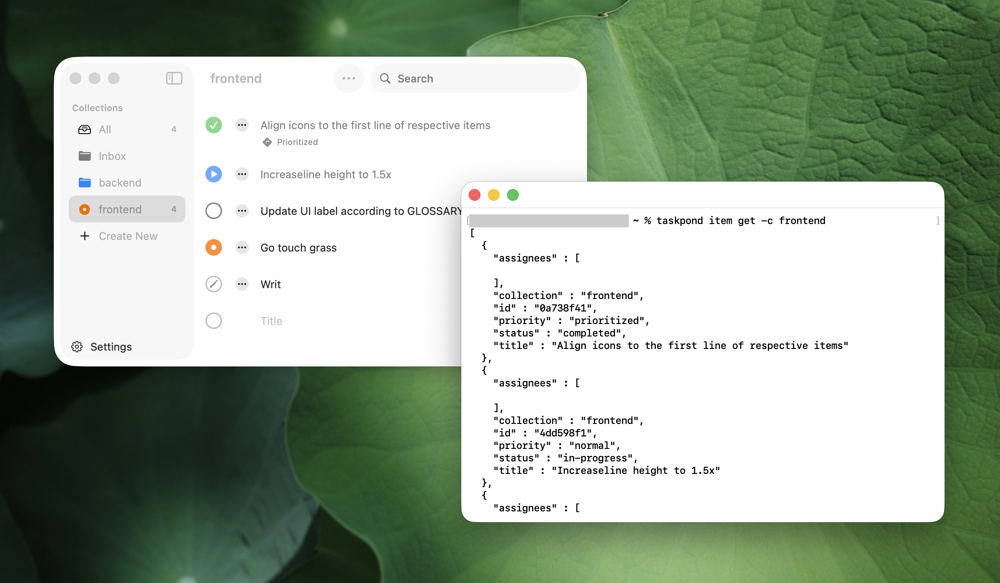

# Pond

A small macOS task app with a shared command line interface.

## Build

```sh
swift build
```

To create the macOS app bundle:

```sh
./Scripts/package-app.sh
```

The app bundle is written to `dist/Pond.app`.

To create a bundle with explicit release metadata:

```sh
./Scripts/package-app.sh --version 0.1.0 --build 0.1.0.123
```

## CLI

```sh
taskpond item create [-c|--collection <collection>] <title...>
taskpond item get [-s|--status <status>] [-c|--collection <collection> | <id...>]
taskpond item update <id> [-c|--collection <collection>] [-s|--status <status>] [<title...>]
taskpond item note add <id> --body <body>
taskpond item note update <id> --body <body>
taskpond item note delete <id>
taskpond item delete <-c|--collection <collection> | <id...>>
taskpond collection list
taskpond collection create <name>
taskpond collection rename <old-name> <new-name>
taskpond collection color <name> <gray|red|orange|yellow|green|blue|purple>
taskpond collection delete <name>
taskpond collection clear <name> [--completed]
```

`taskpond item update --status` requires one status: `ready`, `draft`, `in-progress`, `completed`, `on-hold`, or `aborted`.
`taskpond item update` changes an existing item in place without changing its id.
Successful non-help CLI commands write JSON to standard output. Item output includes `id`, `status`, `collection`, and `title`.

Examples:

```sh
taskpond item create --collection Inbox "Buy milk"
taskpond item get
taskpond item get -s ready -c Inbox
taskpond item update 1a2b3c4d --collection Errands -s ready "Buy oat milk"
taskpond item update 1a2b3c4d --status completed
taskpond item update 1a2b3c4d --status draft
taskpond item update 1a2b3c4d --status in-progress
taskpond item update 1a2b3c4d --status on-hold
taskpond item update 1a2b3c4d --status aborted
taskpond item delete 1a2b3c4d
taskpond item delete --collection Inbox
taskpond collection list
taskpond collection create Errands
taskpond collection rename Errands Personal
taskpond collection color Personal blue
taskpond collection clear Personal --completed
taskpond collection delete Personal
```

The GUI settings window can install a `taskpond` symlink into `~/.local/bin/taskpond`. For a packaged `.app`, place the CLI binary at:

```text
Pond.app/Contents/Library/Helpers/taskpond
```
